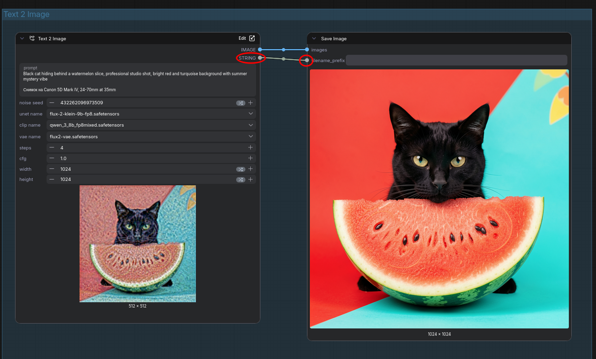
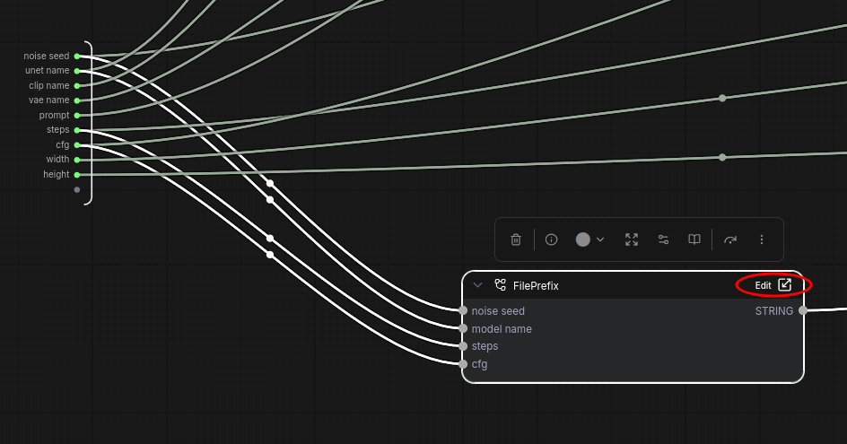
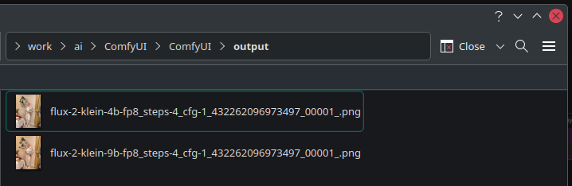

# ComfyUI Primitive Convert

Custom nodes for [ComfyUI](https://github.com/comfyanonymous/ComfyUI) that convert between primitive data types (string, integer, float, boolean).

## Installation

1. Clone this repo into your `ComfyUI/custom_nodes/` folder:
    ```bash
    cd ComfyUI/custom_nodes
    git clone https://github.com/microcoder/comfyui-primitive-convert.git
    ```

2. Restart ComfyUI

## Nodes

All nodes are located in the `utils/convert` category.

### To String

Converts any input value to its string representation.
Supports: numbers, booleans, None, tensors, lists, dictionaries — anything that has a `str()` representation.

### To Int

Converts input to an integer:

* `FLOAT` → rounded to nearest integer
* `STRING` → parsed as number (e.g., `"42"` → `42`)
* `BOOLEAN` → True = `1`, False = `0`
* Invalid or empty input → `0`

### To Float

Converts input to a floating-point number:

* `INT` → converted to float (e.g., `42` → `42.0`)
* `STRING` → parsed as float (e.g., `"3.14"` → `3.14`)
* `BOOLEAN` → True = `1.0`, False = `0.0`
* Invalid or empty input → `0.0`

## Use Cases

You can use this for input node parameter `filename_prefix` of the Save Image node to name the output generations meaningfully. For example ([Download the workflow](_media/Flux.2_klein.json)):




In the output folder you will get file names similar to the following:



## License

MIT
